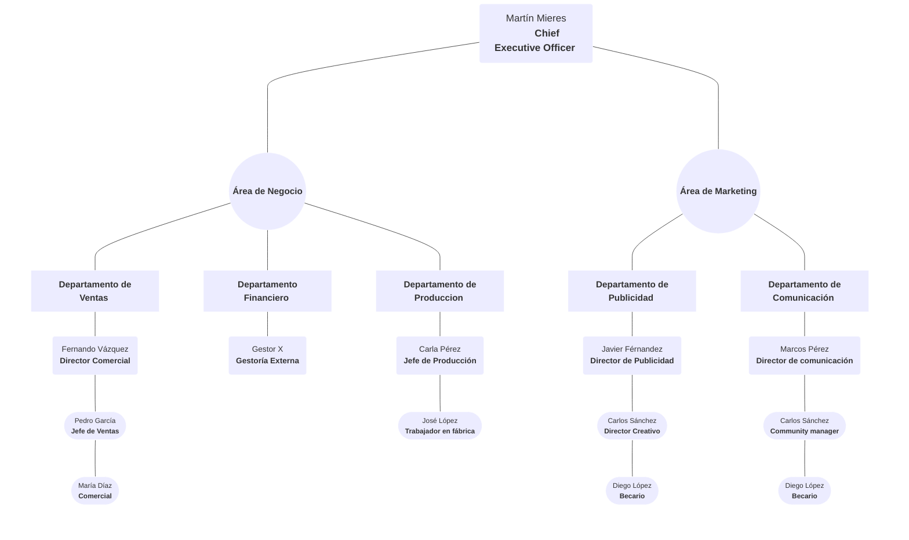

# diagram

```mermaid

flowchart TB

    classDef integrantes fill:#ff, stroke:#fff, stroke-width:0.5px, font-size: 20px;
    classDef departamento fill:none, stroke:none;
    classDef area fill:#ff, stroke:#fff, stroke-width:0.5px, font-size: 18px;
    classDef subdpto fill:#ff, stroke:#fff, stroke-width:0.5px, font-size: 18px; 
    classDef integrantes2 fill:#ff, stroke:#fff, stroke-width:0.5px, font-size: 16px;
    classDef integrantes3 fill:#ff, stroke:#fff, stroke-width:0.5px, font-size: 14px;

    

    %% Aplicacion de estilos a los departamentos
    departamentodeMarketing:::departamento
    departamentoDeComunicacion:::departamento
    departamentoDePublicidad:::departamento
    departamentodeNegocio:::departamento
    departamentoDeProduccion:::departamento
    departamentoFinanciero:::departamento
    departamentoDeVentas:::departamento
    


    %% Aplicacion de estilos a los subdepartamentos
    dptoComunicacion:::subdpto
    dptoPublicidad:::subdpto
    dptoProduccion:::subdpto
    dptoFinanciero:::subdpto
    dptoVentas:::subdpto
   

    %% Aplicacion de estilos a las areas
    areaDeMarketing:::area
    areaDeNegocio:::area

    %% Aplicacion de estilos a los integrantes
    ceo:::integrantes
    directorDeComunicacion:::integrantes2
    directorDePublicidad:::integrantes2
    jefeDeProduccion:::integrantes2
    gestoria:::integrantes2
    directorComercial:::integrantes2
    communityManager:::integrantes3
    becario1:::integrantes3
    directorCreativo:::integrantes3
    becario2:::integrantes3
    trabajador:::integrantes3
    jefeDeVentas:::integrantes3
    comercial:::integrantes3


    %% Definicion de relaciones
    ceo ----- areaDeMarketing

    areaDeMarketing --- dptoComunicacion
    dptoComunicacion --- directorDeComunicacion
    directorDeComunicacion --- communityManager
    communityManager --- becario1

    areaDeMarketing --- dptoPublicidad
    dptoPublicidad --- directorDePublicidad
    directorDePublicidad --- directorCreativo
    directorCreativo --- becario2
    
    ceo ----- areaDeNegocio

    areaDeNegocio --- dptoProduccion
    dptoProduccion --- jefeDeProduccion
    jefeDeProduccion --- trabajador
    
    areaDeNegocio --- dptoFinanciero
    dptoFinanciero --- gestoria

    areaDeNegocio --- dptoVentas
    dptoVentas --- directorComercial
    directorComercial --- jefeDeVentas
    jefeDeVentas --- comercial


    
    %%% Diseñamos el organigrama

    ceo(
        Martín Mieres
        <b> Chief Executive Officer </b>
    )

    %% Área de marketing
    subgraph departamentodeMarketing[ ]
        areaDeMarketing((<b> Área de Marketing </b>))

        subgraph departamentoDeComunicacion[ ]
            dptoComunicacion[<b> Departamento de Comunicación </b>]
            directorDeComunicacion(
                Marcos Pérez
                <b> Director de comunicación </b>
            )
            communityManager([
                Carlos Sánchez
                <b> Community manager </b>
            ])
            becario1([
                Diego López
                <b> Becario </b>
            ])
        end
        
        subgraph departamentoDePublicidad[ ]
            dptoPublicidad[<b> Departamento de Publicidad </b>]
            directorDePublicidad(
                Javier Férnandez
                <b> Director de Publicidad </b>
            )
            directorCreativo([
                Carlos Sánchez
                <b> Director Creativo </b>
            ])
            becario2([
                Diego López
                <b> Becario </b>
            ])
        end

    end

    %% Área de negocio
    subgraph departamentodeNegocio[ ]
        areaDeNegocio((<b> Área de Negocio </b>))

        subgraph departamentoDeProduccion[ ]
            dptoProduccion[<b> Departamento de Produccion </b>]
            jefeDeProduccion(
                Carla Pérez
                <b> Jefe de Producción </b>
            )
            trabajador([
                José López
                <b> Trabajador en fábrica </b>
            ])
        end
        
        subgraph departamentoFinanciero[ ]
            dptoFinanciero[<b> Departamento Financiero </b>]
            gestoria(
                Gestor X
                <b> Gestoría Externa </b>
            )
        end

        subgraph departamentoDeVentas[ ]
            dptoVentas[<b> Departamento de Ventas </b>]
            directorComercial(
                Fernando Vázquez
                <b> Director Comercial </b>
            )
            jefeDeVentas([
                Pedro García
                <b> Jefe de Ventas </b>
            ])
            comercial([
                María Díaz
                <b> Comercial </b>
            ])
        end

    end


    linkStyle default stroke-width: 1px;
```
