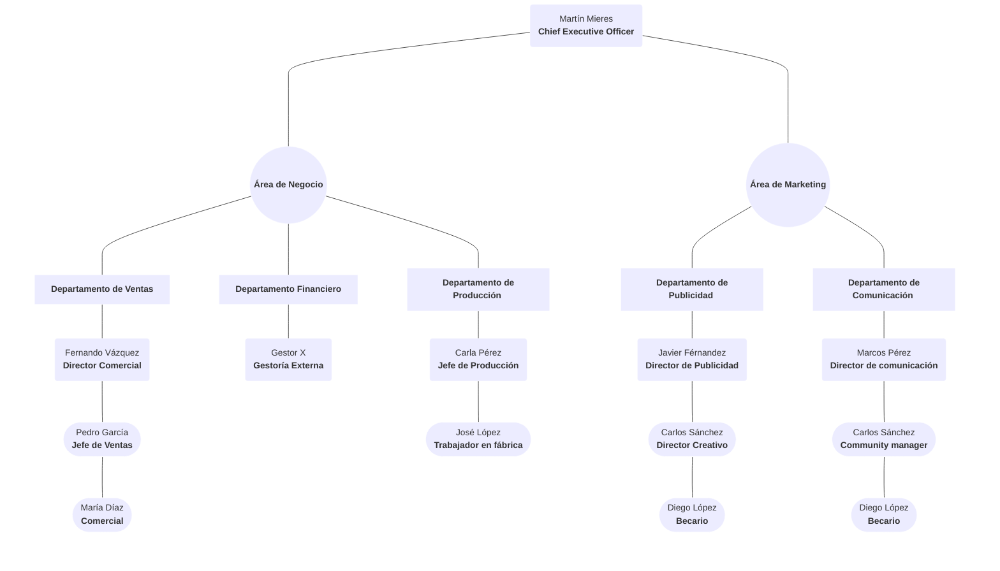

# ORGANIGRAM OF A FICTITIOUS COMPANY

```mermaid

graph TD;

    classDef integrantes fill:#ff, stroke:#fff, stroke-width:0.5px;
    classDef departamento fill:none, stroke:none;
    classDef area fill:#ff, stroke:#fff, stroke-width:0.5px;
    classDef subdpto fill:#ff, stroke:#fff, stroke-width:0.5px; 
    classDef integrantes2 fill:#ff, stroke:#fff, stroke-width:0.5px;
    classDef integrantes3 fill:#ff, stroke:#fff, stroke-width:0.5px;

    

    %% Aplicacion de estilos a los departamentos
    departamentodeMarketing:::departamento
    departamentoDeComunicacion:::departamento
    departamentoDePublicidad:::departamento
    departamentodeNegocio:::departamento
    departamentoDeProduccion:::departamento
    departamentoFinanciero:::departamento
    departamentoDeVentas:::departamento
    


    %% Aplicacion de estilos a los subdepartamentos
    dptoComunicacion:::subdpto
    dptoPublicidad:::subdpto
    dptoProduccion:::subdpto
    dptoFinanciero:::subdpto
    dptoVentas:::subdpto
   

    %% Aplicacion de estilos a las areas
    areaDeMarketing:::area
    areaDeNegocio:::area

    %% Aplicacion de estilos a los integrantes
    ceo:::integrantes
    directorDeComunicacion:::integrantes2
    directorDePublicidad:::integrantes2
    jefeDeProduccion:::integrantes2
    gestoria:::integrantes2
    directorComercial:::integrantes2
    communityManager:::integrantes3
    becario1:::integrantes3
    directorCreativo:::integrantes3
    becario2:::integrantes3
    trabajador:::integrantes3
    jefeDeVentas:::integrantes3
    comercial:::integrantes3

   %% Definicion de relaciones
    ceo ----- areaDeMarketing

    areaDeMarketing --- dptoComunicacion
    dptoComunicacion --- directorDeComunicacion
    directorDeComunicacion --- communityManager
    communityManager --- becario1

    areaDeMarketing --- dptoPublicidad
    dptoPublicidad --- directorDePublicidad
    directorDePublicidad --- directorCreativo
    directorCreativo --- becario2
    
    ceo ----- areaDeNegocio

    areaDeNegocio --- dptoProduccion
    dptoProduccion --- jefeDeProduccion
    jefeDeProduccion --- trabajador
    
    areaDeNegocio --- dptoFinanciero
    dptoFinanciero --- gestoria

    areaDeNegocio --- dptoVentas
    dptoVentas --- directorComercial
    directorComercial --- jefeDeVentas
    jefeDeVentas --- comercial

    %%% Diseñamos el organigrama

    ceo(Martín Mieres <br><b> Chief Executive Officer </b></br>);

    %% Área de marketing
    subgraph departamentodeMarketing[ ]
        areaDeMarketing((<b> Área de Marketing </b>));

        subgraph departamentoDeComunicacion[ ]
            dptoComunicacion[<b> Departamento de Comunicación </b>];
            directorDeComunicacion(Marcos Pérez <br><b> Director de comunicación </b></br>);
            communityManager([Carlos Sánchez <br><b> Community manager </b></br>]);
            becario1([Diego López <br><b> Becario </b></br>]);
        end
        
        subgraph departamentoDePublicidad[ ]
            dptoPublicidad[<b> Departamento de Publicidad </b>];
            directorDePublicidad(Javier Férnandez <br><b> Director de Publicidad </b></br>);
            directorCreativo([Carlos Sánchez <br><b> Director Creativo </b></br>]);
            becario2([Diego López <br><b> Becario </b></br>]);
        end

    end

    %% Área de negocio
    subgraph departamentodeNegocio[ ]
        areaDeNegocio((<b> Área de Negocio </b>));

        subgraph departamentoDeProduccion[ ]
            dptoProduccion[<b> Departamento de Producción </b>];
            jefeDeProduccion(Carla Pérez <br><b> Jefe de Producción </b></br>);
            trabajador([José López <br><b> Trabajador en fábrica </b></br>]);
        end
        
        subgraph departamentoFinanciero[ ]
            dptoFinanciero[<b> Departamento Financiero </b>];
            gestoria(Gestor X <br><b> Gestoría Externa </b></br>);
        end

        subgraph departamentoDeVentas[ ]
            dptoVentas[<b> Departamento de Ventas </b>];
            directorComercial(Fernando Vázquez <br><b> Director Comercial </b></br>);
            jefeDeVentas([Pedro García <br><b> Jefe de Ventas </b></br>]);
            comercial([María Díaz <br><b> Comercial </b></br>]);
        end

    end

    linkStyle default stroke-width: 1px;
```

```
