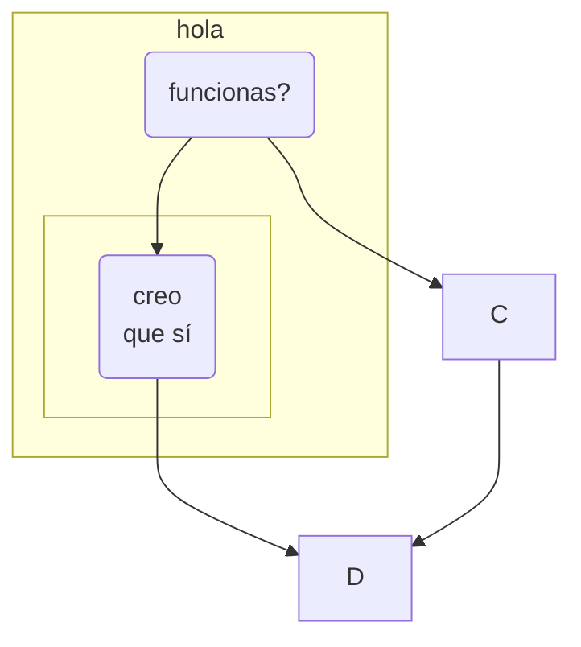

Example of mermaid diagram

```mermaid

graph TD;

    A-->B;
    A-->C;
    B-->D;
    C-->D;

    %%hola buenos días
    subgraph T[hola]
        A(funcionas?)

        subgraph G[ ]
            B(creo
            que sí)
        end

    end

    linkStyle default stroke-width: 1px;

```
